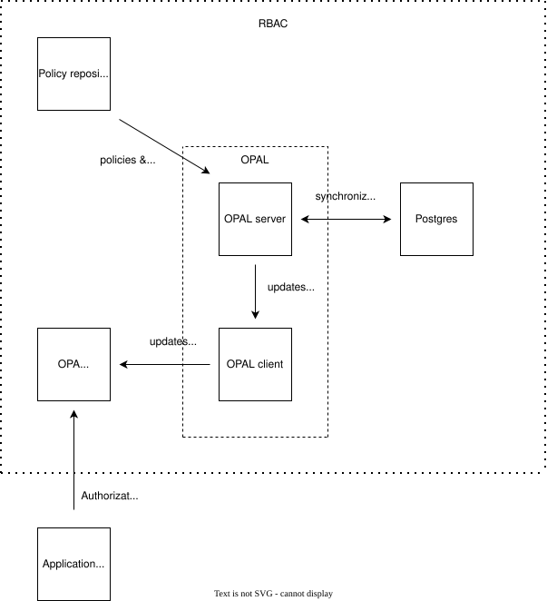

<p align="center">
  <a href="https://okdp.io">
    
  </a>
</p>

[](https://github.com/OKDP/hive-metastore/actions/workflows/ci.yml)
[](https://github.com/OKDP/hive-metastore/actions/workflows/release-please.yml)
[](https://github.com/OKDP/hive-metastore/releases/latest)
[](http://www.apache.org/licenses/LICENSE-2.0)

# OPA deployment with OPAL

Integrates [Open Policy Agent](https://www.openpolicyagent.org/) (OPA) an Role-based access control (RBAC) manager with [Open Policy Administration Layer](https://docs.opal.ac/) (OPAL), its GitOps RBAC policy reconciliation tool for the use of an external component like Trino.

## Why this Project

The OPAL helm chart does not deploy by itself the OPAL server in safemode. Therefore, a helm chart `opal-secrets` has been added as pre-hook project to prepare the secrets for the safemode-deployment. The values.yaml of OPA and OPAL are also set for both services to work together.

## What the project does

OPA streamlines policy management for components accross the stack with GitOps reconcilaiation through OPAL. The policies are stored in a Git repository and their modification is directly taken into account through the OPAL server which fetches them and transfers them to OPA by passing through the OPA-client.

## Architecture

<p align="center">
  
</p>

Contrary to the archticture presented in the official [OPAL website](https://docs.opal.ac/overview/architecture), by default no external data source is used here and the Postgres DBMS is used to syncronize between all the instances of OPAL Server.

## Requirements

- Kubernetes cluster (>= 1.19)
- [Helm](https://helm.sh/) >= 3

### Toolchain tested

| Tool | Version |
|---|---|
| Kubernetes (Kind) | `1.34.0` |
| Kind | `0.30.0` |
| Helm CLI | `4.0.4` |
| kubectl | `1.34.0` |
| Docker | `28.3.2` |

## Installation

### OPA deployment

Download OPA helm chart

```sh
helm repo add opa-kube-mgmt https://open-policy-agent.github.io/kube-mgmt/charts
helm repo update
```

Install OPA without kube-mgmt in opa-ns namespace with custom values

```sh
helm install --create-namespace -n opa-ns opa opa-kube-mgmt/opa-kube-mgmt --version 11.0.7 -f helm/opa-server/values.yaml
```

Install OPA with kube-mgmt in opa-ns namespace with custom values

```sh
helm install --create-namespace -n opa-ns opa opa-kube-mgmt/opa-kube-mgmt --version 11.0.7 -f helm/opa-server/values-mgmt.yaml
```

*NB*: Do not deploy OPAL afterwards if Kube-management is deployed as both will conflict.

### OPA configuration

The full chart custom values are in the [Helm chart](helm/opa-server/values.yaml). Here are some customized values for our deployment:

| Parameter | Description | Default |
|---|---|---|
| `useHttps` | Secure OPA server with TLS | `false` |
| `certManager.enabled` | Create TLS certificate for OPA server | `false` |
| `port` | Port to which the OPA pod will bind itself | `8181` |
| `image.repository` | The image used for OPA | `openpolicyagent/opa` |
| `image.tag` | The version of the OPA image | `1.16.1` |
| `mgmt.enabled` | Enable Kube-management for OPA | `false` in values.yaml and `true` in values-mgmt.yaml |
| `mgmt.namespace` | Limit Kube-management to search policies and adta to a list of namespaces, if empty it is limited to the current namespace, | `[]` |
| `authz.enabled` | Enable Authorization token verification for Kube-management | `false` |
| `rbac.create` |  Create ClusterRole for Kube-management | `false`|
| `serviceAccount.create` |  Create serviceAccount for Kube-management | `false` |

In this case, kube-management isn't necessary since the policies are syncronised through OPAL and TLS securisation isn't required as OPA is not intented to be exposed outside of the cluster and the OPAL client must then later on also be TLS secured with the same certificate CA in this case.

The port number is very important since the OPAL-client connects to the OPA server through it.

### OPAL prerequisites

Before deploying OPAL, an ssh private and public key must be generated as well as a master token for securing the OPAL server and the OPAL client needs a client JWT token generated by the OKDP server with the use of the previous mentioned elements to access it. Therefore, the opal-secrets helm chart has been added to create them all as Kubernetes secrets. Execute it the following way:

```sh
helm install -n opa-ns opal-secrets helm/opal-secrets
```

### OPAL prerequsites configuration

| Parameter | Description | Default |
|---|---|---|
| `ssh_secret` | K8s secret containing ssh private and public keys | `opal-ssh-secret` |
| `master_token_secret` | K8s secret containing master token | `opal-master-token-secret` |
| `jwt_client_token_secret` | K8s secret containing generated client token | `opal-client-token-secret` |

### OPAL deployment

Download OPAL helm chart

```sh
helm repo add permitio https://permitio.github.io/opal-helm-chart
helm repo update
```

Install OPAL

```sh
helm install -n opa-ns -f helm/opal/values.yaml --version 0.0.30 opal permitio/opal
```

### OPAL configuration

The full chart custom values are in the [Helm chart](helm/opal/values.yaml). Here are some customized values for our deployment:

| Parameter | Description | Default |
|---|---|---|
| `server.policyRepoUrl` | URL of your policy repository | `https://github.com/OKDP/okdp-examples.git` |
| `server.policyRepoSshKey` | ssh private key allowed to access your private policy repository | `false` |
| `server.policyRepoMainBranch` | Used branch of the policy repository  | `main` |
| `server.extraEnv.OPAL_POLICY_REPO_WEBHOOK_SECRET` | GitHub webhook secret | `null` |
| `server.extraEnv.OPAL_POLICY_REPO_MANIFEST_PATH` | Path to the manifest file | `trino_opa_policy` |
| `server.pollingInterval` | Interval between the polling of the server | `30` |
| `server.secrets` | K8s secrets containing ssh keys and master token | `[opal-ssh-secret, opal-master-token-secret]` |
| `server.dataConfigSources.config.entries` |  External source for policy data | `[]` |
| `client.extraEnv.OPAL_POLICY_STORE_URL` | OPA server URL | `http://opa:8181` |
| `client.extraEnv.OPAL_POLICY_SUBSCRIPTION_DIRS` | Path(s) to the policy files, seperated by `:` | `trino_opa_policy` |
| `client.secrets` | K8s secret containing generated client token | `[opal-client-token-secret]` |
| `image.client.repository` |  The image used for the OPA client | `permitio/opal-client-standalone` |
| `image.client.tag` |  The version of the OPAL client image | `0.9.4` |

Here are some few changes if you want another customized configuration using a webhook and/or using an external datasource for policies.

- If you prefer using a webhook to get the policies which is at the moment only working with GitHub, create first a webhook in the remote repository and then set `server.OPAL_POLICY_REPO_WEBHOOK_SECRET` with the secret generated in Github and set `server.pollingInterval` to `0` so that no polling takes place (not recommended to write the webhook secret in the value.yaml). Moreover, if you chose the webhook, the OPAL server must be exposed to the internet and therefore, an ingress or gateway api object must be joined to its service.
- If you chose to have a Postgres DBMS as external datasource, set the key `image.client.repository` to `quay.io/okdp/opal-client-standalone` and the key `image.client.tag` to `0.9.4-1.0-postgres` which is the image integrating the Postgres fetcher. Also, set `client.extraEnv.OPAL_FETCH_PROVIDER_MODULES` to `opal_common.fetcher.providers,opal_fetcher_postgres.provider` to have the fetcher provier modules and set `server.dataConfigSources.config.entries` with your datasource entries as shown in the comment of the values.yaml. Tables and data must be preexisting in the database before the deployment of OPAL.

## Contributing & License

Contributions follow the [OKDP contribution guide](https://github.com/OKDP/.github/blob/main/CONTRIBUTING.md). Released under the [Apache License 2.0](LICENSE).

---

**Built 🚀 for the OKDP Community**
<a href="https://okdp.io">
  
</a>
